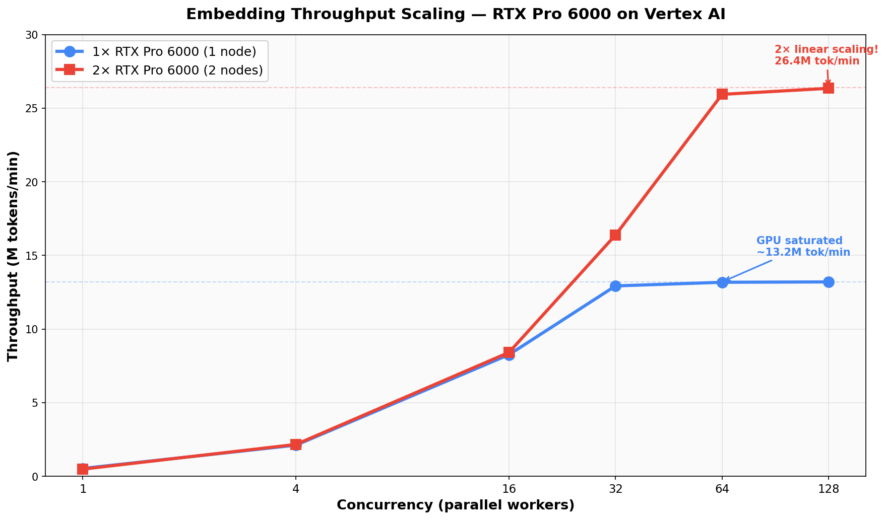
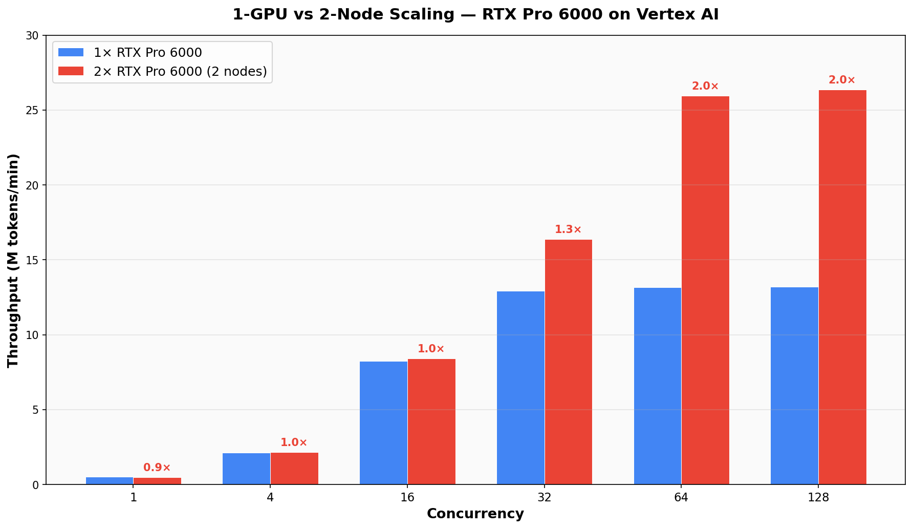
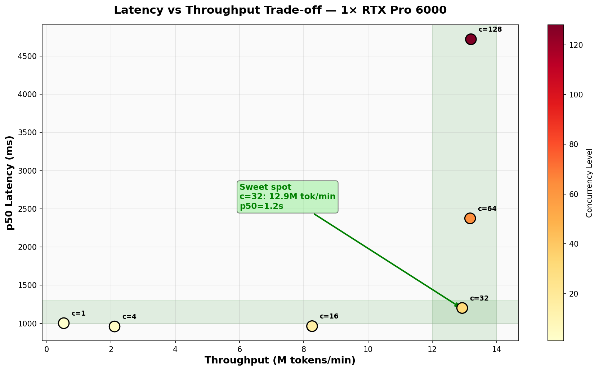

# Embedding Inference Benchmark on Vertex AI with RTX Pro 6000

Benchmarking recipe for evaluating **Jina Embeddings V5 Text Small** on Google Cloud Vertex AI using **NVIDIA RTX Pro 6000** (96GB VRAM) GPUs. This benchmark measures throughput, latency, and cost efficiency for high-throughput batch embedding inference workloads.

## Test Configuration

| Component | Value |
|-----------|-------|
| **Model** | `jinaai/jina-embeddings-v5-text-small` (230M params) |
| **GPU** | NVIDIA RTX Pro 6000 (96GB VRAM) |
| **Machine Type** | `g4-standard-48` (48 vCPU, 192GB RAM) |
| **Platform** | Google Cloud Vertex AI (managed endpoint) |
| **Serving Framework** | vLLM v0.20.1 |
| **Precision** | BF16 |
| **Batch Size** | 16 texts per request |
| **Input Length** | ~512 tokens per text (~250 words) |
| **Tokens/Request** | ~8,192 (16 × 512) |
| **Max Context Window** | 32,768 tokens |
| **max_num_seqs** | 512 |
| **gpu_memory_utilization** | 0.95 |
| **max_num_batched_tokens** | 65,536 |
| **enforce_eager** | True (no CUDA graphs) |
| **Region** | europe-west4 |

## Benchmark Results

### 1-GPU Performance (1× RTX Pro 6000, g4-standard-48)

| Concurrency | Throughput (tok/min) | RPM | p50 Latency | p95 Latency | p99 Latency | Success Rate |
|-------------|---------------------|-----|-------------|-------------|-------------|-------------|
| 1 | 531,171 | 65 | 1,003ms | 1,150ms | 1,406ms | 100% |
| 4 | 2,112,183 | 258 | 960ms | 1,133ms | 1,693ms | 100% |
| 16 | 8,258,393 | 1,008 | 964ms | 1,151ms | 1,699ms | 100% |
| 32 | 12,928,851 | 1,578 | 1,202ms | 1,481ms | 1,893ms | 100% |
| 64 | 13,175,803 | 1,608 | 2,375ms | 2,837ms | 3,084ms | 100% |
| 128 | 13,200,818 | 1,611 | 4,719ms | 5,365ms | 5,469ms | 100% |

**Peak: 13.2M tokens/min on a single RTX Pro 6000**

### 2-GPU Performance (2× RTX Pro 6000, 2 G4 nodes, Vertex AI load-balanced)

| Concurrency | Throughput (tok/min) | RPM | Scaling vs 1-GPU |
|-------------|---------------------|-----|-------------------|
| 1 | 482,721 | 59 | 0.9x |
| 4 | 2,161,867 | 264 | 1.0x |
| 16 | 8,412,492 | 1,027 | 1.05x |
| 32 | 16,388,625 | 2,001 | **1.3x** |
| 64 | 25,941,343 | 3,166 | **1.97x** |
| 128 | 26,350,707 | 3,217 | **2.0x** |

**Peak: 26.4M tokens/min with 2× RTX Pro 6000 — perfect 2× linear scaling at high concurrency!**

### Throughput Scaling



### 1-GPU vs 2-Node Comparison



### Latency vs Throughput Trade-off



### Key Findings

- **GPU saturates at concurrency ~32** on a single GPU — throughput plateaus at ~13M tok/min
- **Near-linear 2× scaling** with 2 nodes at concurrency ≥64
- **Sweet spot for 1-GPU**: concurrency=32 gives 12.9M tok/min with only 1.2s p50 latency
- **Sweet spot for 2-GPU**: concurrency=64 gives 25.9M tok/min with 2.4s p50 latency
- **Zero errors** across all 12,000+ requests in successful runs
- **All latencies under 20 seconds**

## Architecture

```
Local Machine (benchmark client)
  └─ Python aiohttp async HTTP load generator
      └─ HTTPS POST to Vertex AI rawPredict endpoint
          └─ Vertex AI Proxy (auth + load balancing)
              └─ G4 VM (g4-standard-48, 48 vCPU)
                  └─ NVIDIA RTX Pro 6000 (96GB VRAM)
                      └─ vLLM v0.20.1 serving container
                          └─ Jina Embeddings V5 Text Small (230M params, BF16)
```

## Quick Start

### Prerequisites

- Google Cloud project with Vertex AI API enabled
- `gcloud` CLI authenticated
- Python 3.10+ with `pip install aiohttp numpy pyyaml`
- RTX Pro 6000 quota in your region (check: `gcloud compute accelerator-types list --filter="name:nvidia-rtx-pro-6000"`)

### Step 1: Build and Push the Container

```bash
cd deploy

# Create Artifact Registry repo (if needed)
gcloud artifacts repositories create embedding-benchmark \
  --repository-format=docker \
  --location=YOUR_REGION \
  --project=YOUR_PROJECT_ID

# Build with Cloud Build
gcloud builds submit \
  --project=YOUR_PROJECT_ID \
  --region=YOUR_REGION \
  --tag=YOUR_REGION-docker.pkg.dev/YOUR_PROJECT_ID/embedding-benchmark/jina-v5-vllm:v0.20.1 \
  --timeout=1800
```

### Step 2: Upload Model to Vertex AI

```bash
gcloud ai models upload \
  --region=YOUR_REGION \
  --project=YOUR_PROJECT_ID \
  --display-name=jina-v5-embedding \
  --container-image-uri=YOUR_REGION-docker.pkg.dev/YOUR_PROJECT_ID/embedding-benchmark/jina-v5-vllm:v0.20.1 \
  --container-predict-route=/v1/embeddings \
  --container-health-route=/health \
  --container-ports=8000 \
  --container-args="--model,jinaai/jina-embeddings-v5-text-small,--host,0.0.0.0,--port,8000,--max-model-len,32768,--dtype,bfloat16,--tensor-parallel-size,1,--trust-remote-code,--max-num-seqs,512,--gpu-memory-utilization,0.95,--enforce-eager,--max-num-batched-tokens,65536,--disable-log-stats"
```

### Step 3: Create Endpoint and Deploy

```bash
# Create endpoint
gcloud ai endpoints create \
  --region=YOUR_REGION \
  --project=YOUR_PROJECT_ID \
  --display-name=jina-v5-endpoint

# Get model ID
MODEL_ID=$(gcloud ai models list --region=YOUR_REGION --project=YOUR_PROJECT_ID \
  --filter="displayName:jina-v5-embedding" --format="value(name)")

# Get endpoint ID
ENDPOINT_ID=$(gcloud ai endpoints list --region=YOUR_REGION --project=YOUR_PROJECT_ID \
  --filter="displayName:jina-v5-endpoint" --format="value(name)")

# Deploy (1 GPU)
gcloud ai endpoints deploy-model $ENDPOINT_ID \
  --region=YOUR_REGION \
  --project=YOUR_PROJECT_ID \
  --model=$MODEL_ID \
  --display-name=jina-v5-1gpu \
  --machine-type=g4-standard-48 \
  --accelerator=type=nvidia-rtx-pro-6000,count=1 \
  --min-replica-count=1 \
  --max-replica-count=1 \
  --traffic-split=0=100

# Deploy (2 GPUs for scaling test)
gcloud ai endpoints deploy-model $ENDPOINT_ID \
  --region=YOUR_REGION \
  --project=YOUR_PROJECT_ID \
  --model=$MODEL_ID \
  --display-name=jina-v5-2gpu \
  --machine-type=g4-standard-48 \
  --accelerator=type=nvidia-rtx-pro-6000,count=1 \
  --min-replica-count=2 \
  --max-replica-count=2 \
  --traffic-split=0=100
```

### Step 4: Run the Benchmark

```bash
# Update config
sed -i '' 's/YOUR_PROJECT_ID/your-actual-project/g' deploy/config.yaml

# Warmup (wait for HTTP 200)
TOKEN=$(gcloud auth application-default print-access-token)
curl -X POST -H "Authorization: Bearer $TOKEN" -H "Content-Type: application/json" \
  -d '{"input": ["warmup"], "model": "jinaai/jina-embeddings-v5-text-small"}' \
  "https://YOUR_REGION-aiplatform.googleapis.com/v1/projects/YOUR_PROJECT_ID/locations/YOUR_REGION/endpoints/$ENDPOINT_ID:rawPredict"

# Run benchmark
python3 -u benchmark/run_benchmark.py \
  --config deploy/config.yaml \
  --endpoint-id $ENDPOINT_ID \
  --gpu-label "1x-rtx-pro-6000" 2>&1 | tee results/my_benchmark.log
```

### Step 5: Cleanup

After benchmarking, undeploy the model and delete resources to stop billing:

```bash
# Get deployed model ID
DEPLOYED_MODEL_ID=$(gcloud ai endpoints describe $ENDPOINT_ID \
  --region=YOUR_REGION --project=YOUR_PROJECT_ID \
  --format="value(deployedModels[0].id)")

# Undeploy the model (stops GPU billing)
gcloud ai endpoints undeploy-model $ENDPOINT_ID \
  --region=YOUR_REGION \
  --project=YOUR_PROJECT_ID \
  --deployed-model-id=$DEPLOYED_MODEL_ID

# (Optional) Delete the endpoint
gcloud ai endpoints delete $ENDPOINT_ID \
  --region=YOUR_REGION \
  --project=YOUR_PROJECT_ID --quiet

# (Optional) Delete the model from Model Registry
gcloud ai models delete $MODEL_ID \
  --region=YOUR_REGION \
  --project=YOUR_PROJECT_ID --quiet
```

> **⚠️ Important:** GPU VMs are billed per-minute while deployed. Always undeploy when done benchmarking.

## Repository Structure

```
embedding-benchmark/
├── benchmark/
│   ├── __init__.py
│   ├── run_benchmark.py          # Main benchmark orchestrator
│   ├── load_generator.py         # Async HTTP load generator (aiohttp)
│   └── workload_profiles.py      # Synthetic data generation + test scenarios
├── deploy/
│   ├── Dockerfile                # vLLM v0.20.1 serving container
│   ├── config.yaml               # GCP project/region configuration
│   ├── deploy_vertex.py          # Vertex AI deployment script
│   └── cleanup_vertex.py         # Resource cleanup utility
├── analysis/
│   ├── cost_calculator.py        # Throughput-vs-cost matrix calculator
│   ├── generate_report.py        # Markdown report generator
│   └── pricing_data.yaml         # GPU pricing reference data
├── results/
│   ├── benchmark_configA-8192_*.json          # 1-GPU (8k context) raw results
│   ├── benchmark_configA-32k-1gpu_*.json      # 1-GPU (32k context) raw results
│   └── benchmark_configA-32k-2node-forced_*.json  # 2-node forced raw results
└── README.md                     # This file
```

## vLLM Server Configuration

The benchmark uses these optimized vLLM parameters for maximum embedding throughput:

| Parameter | Value | Why |
|-----------|-------|-----|
| `--max-model-len` | 32768 | Full 32k context window support |
| `--dtype` | bfloat16 | Native model precision, no quality loss |
| `--trust-remote-code` | enabled | Required for Jina V5's custom model architecture |
| `--max-num-seqs` | 512 | Allow 512 concurrent sequences per batch |
| `--gpu-memory-utilization` | 0.95 | Use 91.2GB of 96GB for batching |
| `--enforce-eager` | enabled | Skip CUDA graphs (embedding = single forward pass) |
| `--max-num-batched-tokens` | 65536 | Pack up to 65k tokens per GPU batch |
| `--disable-log-stats` | enabled | Reduce serving overhead |

## Benchmark Workload Profile

The benchmark simulates a **production batch embedding ingestion** workload with these defaults:

| Parameter | Value | Rationale |
|-----------|-------|-----------|
| **Batch size** | 16 texts/request | Standard batch size for embedding APIs |
| **Tokens per text** | ~512 tokens (~250 words) | Default document chunk size |
| **Tokens per request** | ~8,192 (16 × 512) | Total tokens per HTTP request |
| **Max context window** | 32,768 tokens | Model's maximum supported length |
| **Concurrency levels** | 1, 4, 16, 32, 64, 128 | Gradually increasing parallel workers |
| **Warmup period** | 10 seconds | Requests sent but not measured |
| **Measurement period** | 60 seconds | Per concurrency level |
| **Request format** | OpenAI `/v1/embeddings` API | `{"input": [...], "model": "..."}` |

### Data Generation
- **Synthetic English text** from common words (deterministic, no caching effects)
- Each request: batch of 16 texts × ~512 tokens each = ~8,192 tokens/request
- Each request gets unique text content (different random seed per batch)

### Load Generation
- **Python aiohttp** async HTTP client (not vLLM bench)
- N concurrent async workers (N = concurrency level: 1, 4, 16, 32, 64, 128)
- 10-second warmup (requests sent but not measured) + 60-second measurement window
- Authentication via GCP Application Default Credentials

### Metrics Collected
- **Throughput**: tokens/second, tokens/minute, requests/minute
- **Latency**: p50, p95, p99, min, max (milliseconds)
- **Success rate**: HTTP 200 count vs total requests
- **Error tracking**: per-request status codes and error messages

## Issues Encountered & Solutions

| Issue | Root Cause | Solution |
|-------|-----------|----------|
| vLLM v0.15.1 crash | `JinaEmbeddingsV5Model` not supported | Upgraded to vLLM v0.20.1 |
| `--task embed` flag error | Not available in v0.20.1 CLI | Removed (auto-detected from model) |
| `--trust-remote-code` required | Jina V5 uses custom HuggingFace code | Added flag to container args |
| `g4-standard-8` doesn't exist | Smallest G4 is g4-standard-48 | Used g4-standard-48 |
| Scale-to-zero despite min=1 | Vertex AI autoscaler behavior | Use `min-replica-count=2` for forced 2-node |
| HTTP 400 "decoder prompt empty" | `max-model-len=512` too small for synthetic texts | Increased to 32768 |
| 0% success in benchmark | All requests got HTTP 429 (cold start) | Added warmup loop before benchmark |

## License

Apache 2.0

## Result Files Guide

The `results/` directory contains benchmark data from multiple test runs:

| File | Description | Status |
|------|-------------|--------|
| `benchmark_configA-8192_*.json/csv` | 1-GPU test with max-model-len=8192 | ✅ **Canonical 1-GPU results** (used in README tables) |
| `benchmark_configA-32k-1gpu_*.json/csv` | 1-GPU test with max-model-len=32768 | Validation run (confirms 32k has no throughput penalty) |
| `benchmark_configA-32k-2node-forced_*.json/csv` | 2-node test with min_replica=2 | ✅ **Canonical 2-node results** (used in README tables) |

> **Note:** The `ingest-max-context` scenario entries in all files show `error_rate: 1.0` because the synthetic text generator produces texts exceeding the model's context window. Only the `ingest-default-chunk` scenario results are valid and reported in the README.
